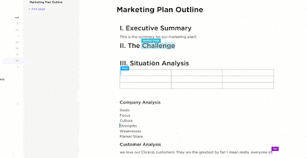
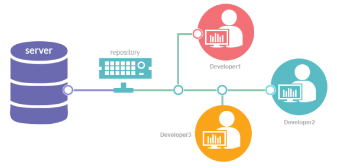
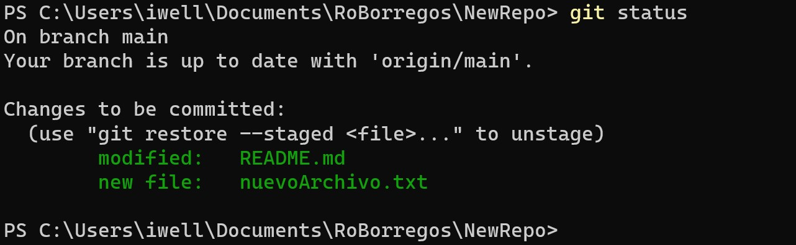

# Git, GitHub, y Control de Versiones
## Por: [Ivan Romero](https://portafolio-ivanromero03.vercel.app/)


---

# Control de Versiones
<div style="display: flex; height:min-screen;">

<ul>
    <li>Colaboración</li>
    <li>Versiones</li>
    <li>Accesibilidad</li>
</ul>
</div>

---

# Git
- Git es el sistema de control de versiones más usado del mundo.
- El pilar de el software libre y el código abierto en el mundo.
- Sistema de control de versiones distribuido.


---

# Control de Versiones Remoto



---

# GitHub
- GitHub es una plataforma de desarrollo colaborativo para alojar proyectos utilizando el sistema de control de versiones Git.
- Permite que se puedan colaborar en proyectos de software.
- La mayoría de los proyectos de software libre y código abierto se almacenan en GitHub.


---

# Cómo usamos Git


---

# Inizializar un repositorio
Inizialisamos un repositorio local
```bash
git init
```
O clonamos un repositorio remoto
```bash
git clone https://github.com/IvanRomero03/GitCourse.git
```

---

# Conexion con GitHub
- Creamos un repositorio en GitHub


---
# Conexion con GitHub
- Agregamos el repositorio remoto
```bash
git remote add origin https://github.com/IvanRomero03/NewRepo.git
```

---

# Realizar cambios
- Agregamos nuestros cambios al Stage
```bash
git add nuevoArchivo.txt README.md
```
o
```bash
git add .
```

---
# Resultado


---

# Compartir los cambios

- Commit
```bash
git commit -m "Agregar archivo de Texto y cambios al Readme 😋"
```
- Push
```bash
git push 
```

---

# Branches
- Branches son ramas de desarrollo
- Se utilizan para desarrollar funcionalidades aisladas unas de otras y luego integrarlas en el proyecto principal.

Agregar un nuevo branch
```bash
git branch nuevaBranch
```
Usar un branch
```bash
git checkout nuevaBranch
```

---

# Pull Request

- Los pull request son presentar los cambios realizados sobre una branch para que sean revisados por otros desarrolladores y así poder integrarlos al proyecto principal.
- Nos permite realizar cambios y uniones de manera organizada y documentada.

---

# Practicando


